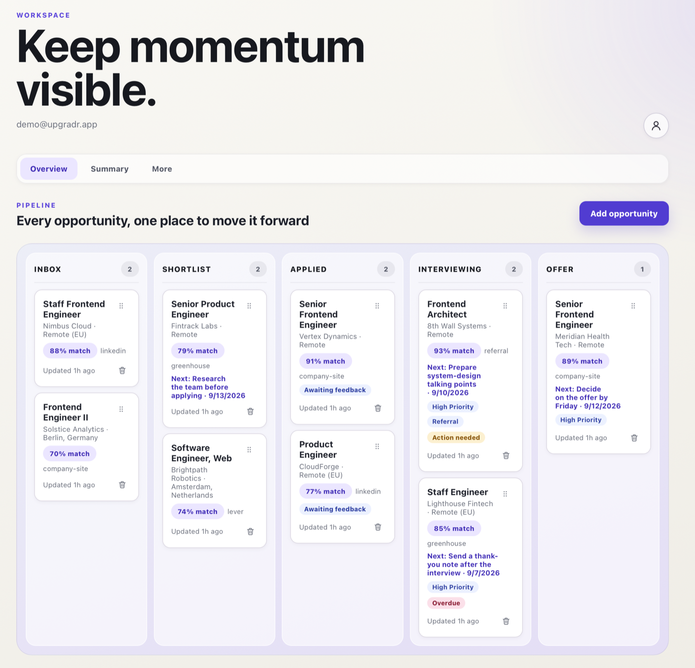

# UpgradR

UpgradR is a web-first job application workspace with a secure MCP interface for agent-assisted job discovery and workflow management.



## Workspace

- `apps/web` - responsive web application
- `apps/mcp-worker` - remote MCP resource server
- `packages/contracts` - shared schemas and transport contracts
- `packages/domain` - pure domain logic
- `packages/profile-import` - bounded LinkedIn CSV and resume-text preview parsers
- `supabase` - database migrations, policies, and tests
- `e2e` - browser and cross-service tests

## Local development

Requirements:

- Node.js 22 or newer
- npm 10 or newer
- Supabase CLI for local database work

Install dependencies:

```sh
npm install
```

Each application contains an `.env.example` or `.dev.vars.example` describing its local configuration.

## Documentation

- [Architecture](docs/architecture.md)
- [Local development](docs/local-development.md)
- [Deployment](docs/deployment.md)
- [Operations](docs/operations.md)
- [MCP interface](docs/mcp.md)
- [Demo/showcase data](docs/demo-data.md)
- [Using UpgradR from GitHub Copilot CLI (no tech background required)](docs/copilot-cli-skill.md)
- [Privacy and data handling](docs/privacy-and-data.md)
- [Threat model](docs/threat-model.md)
